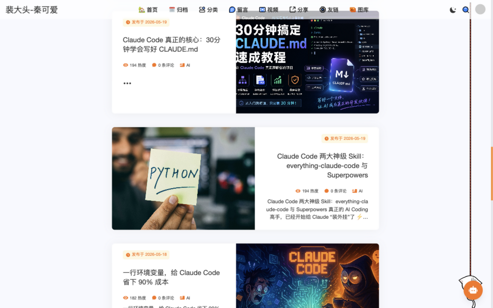
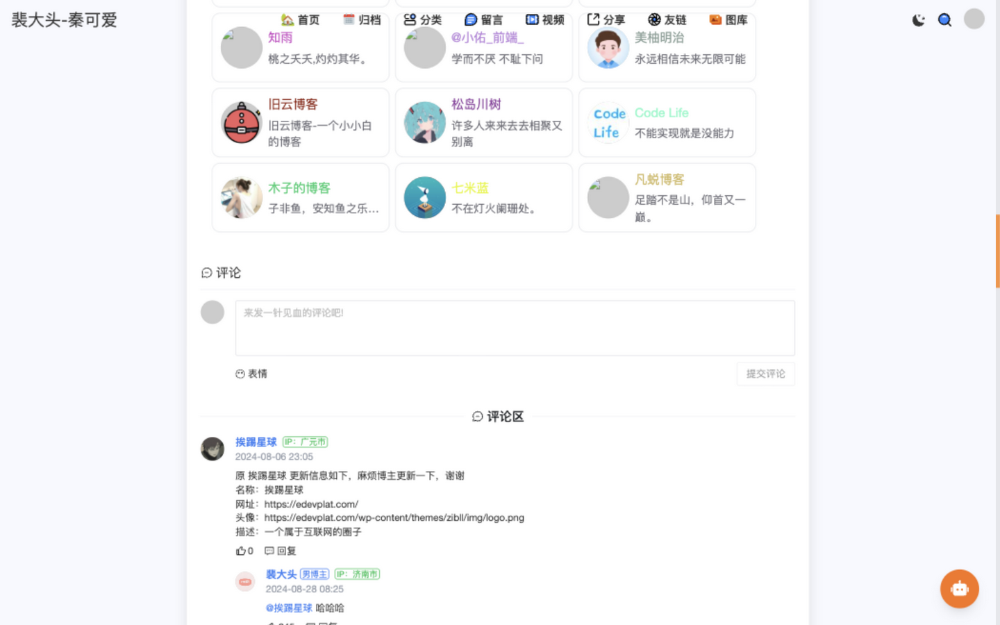
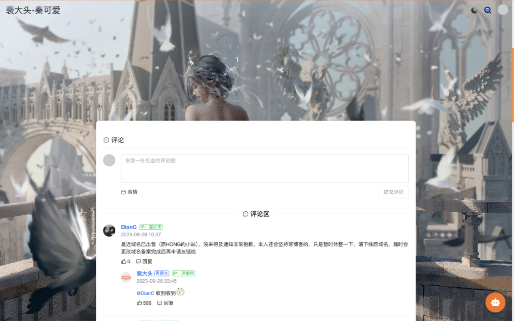

<div align="center">

# Pnkx · Pei你看雪

**个人博客 + 生活管理系统**

基于 Spring Boot + Vue 全栈技术，集成博客、AI 智能助手、生活管理于一体的全端解决方案

v3.3.0

</div>

---

## 项目简介

Pnkx（Pei你看雪）是一个功能完整的个人博客与生活管理系统，涵盖后台管理、博客前台、移动端 App 与小程序。项目采用前后端分离架构，后端基于 Spring Boot 3 + JDK 21，前端基于 Vue 3，并支持 uniapp 多端发布。

在线访问：[https://pnkx.top](https://pnkx.top)

## 系统架构

```
pnkx
├── pnkx-admin      # 后端服务（Spring Boot 多模块）
├── pnkx-ui         # 后台管理系统（Vue 3 + Element Plus）
├── pnkx-client     # 博客前台（Nuxt 3）
└── pnkx-uniapp     # 移动端（uniapp，支持 App / 小程序 / H5）
```

| 子项目 | 技术栈 | 说明 |
| --- | --- | --- |
| `pnkx-admin` | Spring Boot 3 · JDK 21 · MyBatis · Redis · MySQL | 后端服务，多 Maven 模块 |
| `pnkx-ui` | Vue 3 · Vite · Element Plus · Vuex | 博客后台管理系统 |
| `pnkx-client` | Nuxt 3 · Vue 3 | 博客前台，SSR 渲染 |
| `pnkx-uniapp` | uniapp · Vue 2 · uView UI | 移动端，一码多端 |

## 功能清单

### 博客系统

- 文章管理：富文本 / Markdown 编辑、分类、标签、归档
- 相册管理：图片上传、分片上传、进度展示
- 视频管理
- 留言板、友链
- 博客数据统计（含访客地域分布）

### AI 智能助手

- **意图识别**：自动识别记账、待办、日记、消费分析等多种意图
- **SSE 流式响应**：实时流式输出 AI 回复
- **关键词兜底**：AI 分类 + 关键词匹配双重保障，避免漏识别
- **草稿确认机制**：写操作（如记账）需用户确认后才写入数据库

### 生活管理

- **记账系统**：收支记录、分类管理、账户管理、消费统计
- **日记功能**：日记编写、心情记录、日记分析
- **待办事项**：任务管理、智能提醒
- **纪念日提醒**：情侣纪念日倒计时
- **家庭日历**：周视图、日程管理
- **记账纪念关联**：消费与纪念日联动
- **购物清单 / 菜谱 / 用餐记录**
- **订阅管理**：订阅服务跟踪、微信订阅消息
- **经期助手**：情侣经期记录
- **壁纸工具**：壁纸收藏、分享、点赞、文件夹管理
- **读书管理**：个人书库、阅读进度
- **AI 生活周报**：AI 自动生成生活报告

### 系统管理（后台）

- 用户、角色、菜单、字典管理
- 文件管理：分片上传、进度显示
- 定时任务（Quartz）
- 代码生成器
- 系统监控

## 环境依赖

| 依赖 | 说明 |
| --- | --- |
| JDK | 21 及以上 |
| MySQL | 数据存储 |
| Redis | 缓存 |
| Node.js | 前端服务运行环境 |
| Maven | 后端构建 |

## 快速开始

### 后端（pnkx-admin）

```bash
cd pnkx-admin
# 配置数据库与 Redis 连接后
mvn clean install
# 启动主应用
```

### 后台管理（pnkx-ui）

```bash
cd pnkx-ui
npm install
npm run dev      # 开发，访问 http://localhost:80
npm run build:prod   # 构建生产环境
```

### 博客前台（pnkx-client）

```bash
cd pnkx-client
pnpm install
pnpm dev         # 开发
pnpm build       # 构建
```

### 移动端（pnkx-uniapp）

使用 [HBuilderX](https://www.dcloud.io/hbuilderx.html) 打开 `pnkx-uniapp` 目录，支持发布到 App、小程序、H5。

## 功能截图

> 以下截图均截取自在线站点 [pnkx.top](https://pnkx.top) 的真实页面，源文件位于 `docs/screenshots/`。

### 博客首页 · Hero 横幅


### 博客首页 · 文章列表



### 友链



### 留言板



### 移动端

移动端基于 uniapp 开发，支持 App、小程序与 H5：

<table>
  <tr>
    <td></td>
    <td></td>
    <td></td>
  </tr>
  <tr>
    <td></td>
    <td></td>
    <td></td>
  </tr>
</table>

## 项目目录说明

```
.
├── pnkx-admin/              # 后端
│   ├── pnkx-admin/          # 主启动模块
│   ├── pnkx-common/         # 通用工具
│   ├── pnkx-system/         # 系统管理
│   ├── pnkx-framework/      # 框架核心
│   ├── pnkx-blog/           # 博客业务
│   ├── pnkx-life/           # 生活管理业务
│   ├── pnkx-chat/           # AI 对话
│   ├── pnkx-material/       # 素材文件
│   ├── pnkx-quartz/         # 定时任务
│   └── pnkx-generator/      # 代码生成
├── pnkx-ui/                 # 后台管理系统
├── pnkx-client/             # 博客前台
└── pnkx-uniapp/             # 移动端
```

> **注意**：出于安全考虑，数据库脚本（SQL 迁移文件）未包含在本仓库中，请根据后端实体自行创建表结构。

## License

本项目仅供学习交流使用。
